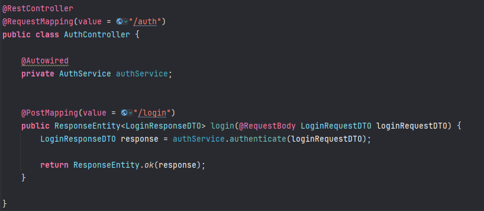

[Notion do Projeto - Fernanda Kipper](https://metal-flea-041.notion.site/Backend-Projeto-Fullstack-App-de-Login-58cb6fbf5dce4dfcb541fd7b7e7e157b)

# Etapas

## Criar Projeto

- [ ] Spring Web
- [ ] Spring Data Jpa
- [ ] Spring Boot Dev Tools
- [ ] Spring Security
- [ ] Lombok
- [ ] JWT
- [ ] H2

## Dependência H2 e JWT

```xml
<dependency>
    <groupId>com.h2database</groupId>
    <artifactId>h2</artifactId>
    <scope>runtime</scope>
</dependency>

<dependency>
    <groupId>com.auth0</groupId>
    <artifactId>java-jwt</artifactId>
    <version>4.4.0</version>
</dependency>
```

## Config H2

```properties
spring.datasource.url=jdbc:h2:mem:testdb
spring.datasource.driver-class-name=org.h2.Driver
spring.datasource.username=sa
spring.datasource.password=
```

## Estrutura pacote

```text
Estrutura pacote
com.moreira.picpaychallenge
├── application        # Regras de negócio específicas de casos de uso
│   ├── dto            # Objetos de transferência de dados
│   ├── services       # Implementações dos casos de uso
│   └── mappers        # Conversores entre entidades e DTOs
├── domain             # Camada de domínio (regra de negócio essencial)
│   ├── entities       # Entidades (modelos de negócio)
│   ├── enums          # Enumerações utilizadas pelo domínio
│   ├── exceptions     # Exceções de domínio
│   └── repositories   # Interfaces para acesso a dados
├── infrastructure     # Camada de infraestrutura (detalhes técnicos)
│   ├── database       # Implementações de repositórios (ex: JPA, MongoDB)
│   ├── configuration  # Configurações (Beans, Security, etc.)
│   └── clients        # Integrações com APIs externas
└── presentation       # Camada de apresentação (entrada/saída)
    ├── controllers    # Endpoints REST
    ├── handlers       # Tratamento de erros e exceções
    └── responses      # Objetos de resposta específicos
```

- [ ] [ Criar entidade que representa o usuário](#user)
- [ ]  Criar `UserRepository`
- [ ] [Criar `TokenService` para geração e validação dos tokens](#tokenservice)
- [ ] [Criar SecurityFilter que irá ser o filtro de segurança](#securityfilter)
- [ ] [Criar `CustomUserDetailsService` pro Spring consultar os usuários](#customuserdetailsservice)
- [ ] Criar `SecurityConfig` para configurar o Spring Security
- [ ] Criar `AuthController`
- [ ] Criar `DTOs` para request e response
- [ ] Criar controller autenticado
- [ ] Configurar CORS
- [ ] Integração com o Frontend

## User

# TokenService

Ficará no pacote infra.config.

O primeiro método dele será o método responsável por gerar/criar o Token quando o usuário fizer login/registro.

Iremos criar um try-catch (JWTCreationException).

Primeira coisa é definir o algoritmo de criptografia que irá gerar o Token: ``Algorithm algorithm = Algorithm.HMAC256()``

Como parâmetro, iremos passar uma secretKey. 

Em resumo, esse algorithm pega uma informação e faz um hash com ela. Ele faz isso utilizando essa chave privada e só 
quem tem essa chave consegue descriptografar depois (obtendo a informação que está hasheada).

Essa chave privada do nosso servidor será responsável por isso: criptografar e descriptografar informações.

Criaremos uma ``private String secret``. (O valor dela virá do .properties) e podemos definir através da variável de
ambiente.

Agora sim, podemos gerar o nosso token, será do tipo String, utilizando:

```java
JWT.create()
        //quem gerou o token
        .withIssuer("login-auth-api")
        //quem está ganhando o token
        .withSubject(user.getEmail())
        //tempo de expiracao
        .withExpiresAt()
        //gerando o token
        .sign(algorithm);
return token
```

Criaremos também um método auxiliar para settar o tempo de expiração do token.

Será um método privado, que irá retornar um instant! Seu nome pode ser ``generateExpirationDate``, vai retornar um
``LocalDateTime.now().plusHours(2).toInstant(ZoneOffset.of(3))`` < tem que confirmar se é 3 mesmo.

Inserir o método no ``.withExpiresAt()``.

## Validando Token

Será um método que retornará uma String, se chamará ``validateToken``. Receberá como parâmetro uma String (token).

Faremos um try-catch, pois caso dê algum erro o JWT irá retornar uma exceção (JWTVerificationException).

Caso caia no catch, retornaremos somente null. Será null, pois caso a gente consiga validar no try, irá ser retornado
o email do usuário (que está nesse token). Caso caia null, eventualmente iremos fazer uma função no filter chain (uma
cadeira de segurança que será criada), onde irá dizer que o usuário não foi autenticado.

O try ficará a mesma coisa do método de criação. Iremos instanciar um Algorithm com a secretKey e retornaremos
```java
JWT.require(algorithm)
    .withIssuer(login-auth-api)
    .build()
    .verify(token)
    //subject pega o valor que foi salvo no token no momento da geração (metodo inicial)
    .getSubject()
```

# SecurityFilter

Também ficará em infra.security.

Será um filtro de segurança. Irá pegar o retorno do Token e autenticar ou não o usuário.

Ele será algo padronizado, portanto, é só inserir o código abaixo:

```java
@Component
public class SecurityFilter extends OncePerRequestFilter {
    @Autowired
    TokenService tokenService;
    @Autowired
    UserRepository userRepository;

    @Override
    protected void doFilterInternal(HttpServletRequest request, HttpServletResponse response, FilterChain filterChain) throws ServletException, IOException {
        var token = this.recoverToken(request);
        var login = tokenService.validateToken(token);

        if(login != null){
            //passamos o OrElseThrow pois estamos retornando um Optional de User no repository
            User user = userRepository.findByEmail(login).orElseThrow(() -> new RuntimeException("User Not Found"));
            var authorities = Collections.singletonList(new SimpleGrantedAuthority("ROLE_USER"));
            var authentication = new UsernamePasswordAuthenticationToken(user, null, authorities);
            SecurityContextHolder.getContext().setAuthentication(authentication);
        }
        filterChain.doFilter(request, response);
    }

    private String recoverToken(HttpServletRequest request){
        var authHeader = request.getHeader("Authorization");
        if(authHeader == null) return null;
        return authHeader.replace("Bearer ", "");
    }
}
```

## Entendendo a extensão.

### OncePerRequestFilter

Irá ser executado uma vez para cada request que chegar na API. O Spring Security nada mais é do que um filtro para o 
nosso Controller. Antes da informação chegar no controller e ser processada no Service, esse filtro do Spring Security
irá agir antes, autenticando ou não o usuário.

## Entendendo métodos


### Recover Token

Método auxiliar. Recebe o request (que veio do usuário), pega a header (authorization) e testa para ver se ela está 
nula.

Entenda, se você muda onde você passa o token (para o body, por exemplo), você precisa mudar essa função (recoverToken).

Se a header não estiver nula, nós iremos dar um replace no bearer por vazio!

Geralmente fica assim: "Authorization: Bearer {token aqui}".

O que nós fazemos no replace, é retirar esse Bearer, deixando somente o token: "Authorization: {token aqui}".

E nós retornamos esse valor!

```java
```

### DoFilterInternal

É o método do filtro em sí.

Iremos criar uma variável token, utilizando o método [Recover Token](#recover-token).

Criar outra variável para login, onde iremos utilizar o Service juntamente com o método de validação (validateToken).
Essa variável será em suma o email (que é o que é retornado no nosso método).

Depois um if, verificando se esse login não está nulo. Caso não esteja, iremos:

1. Procurar o User pelo email;
2. Criar um variável de authorities com uma coleção de ROLES. Neste caso, será só USER (visto que é uma aplicação mais
   simples);
3. Criar um objeto de autenticação, instanciando um new ``UsernamePasswordAuthenticationToken(user, null, authorities)``.
4. Após criar esse objeto de autenticação, settaremos o SecurityContextHolder.getContext().setAuthentication(variável de
   autenticação aqui).

Esse SecurityContextHolder é o contexto de segurança do Spring Security! Cada componente do Security é responsável por
uma etapa, e elas vão alimentando o contexto do Security, para que ele saiba o que ele já validou ou não e salvar
as informações do Usuário que já estiver autenticada.

```java
```

RESUMO:

1. Pegar o token do usuário pelo método recoverToken (que recebe uma Request HTTP);
2. Cria uma variável de login para validar o token utilizando o [tokenService](#tokenservice);
3. Se o login não for nulo, o usuário será adicionado no contexto do Spring;
4. Se o login for nulo (não estiver logado), nada será adicionado no contexto.

# CustomUserDetailsService

Classe que o Spring Security utiliza para consultar os Usuários.

Essa classe irá implementar a interface UserDetailsService (que vem do Spring Security).

Essa interface possui alguns métodos obrigatórios (loadUserByUsername).

Por isso, injetaremos o UserRepository, para podermos utilizá-lo dentro do método.

Dentro do método em sí, iremos instanciar um novo User, utilizando o repository para encontrar o mesmo pelo email, 
utilizando a propria exceção do Spring Security (UsernameNotFoundException).

Lembrando, o retorno é um UserDetails (um user na visão do Spring Security), não user entidade. Passaremos no retorno
o email, password e o array de roles.


# SecurityConfig

Classe de configuração final para o Spring Security. 

Ela irá juntar tudo que montamos até agora, adicionando o filtro (proxy), em cada uma das requisições.

A classe ficará em infra.security.

```java
@Configuration
@EnableWebSecurity
public class SecurityConfig {

   @Autowired
   private CustomUserDetailsService customUserDetailsService;

   @Autowired
   private SecurityFilter securityFilter;

   @Bean
   public SecurityFilterChain securityFilterChain(HttpSecurity http) throws Exception {
      http
              .csrf(csrf -> csrf.disable())
              .sessionManagement(session -> session.sessionCreationPolicy(SessionCreationPolicy.STATELESS))
              .authorizeHttpRequests(authorize -> authorize
                              .requestMatchers(HttpMethod.POST, "/auth/login").permitAll()
                              .requestMatchers(HttpMethod.POST, "/users/register").permitAll()
                              .anyRequest().authenticated()

                                //caso queira liberar endpoint do H2
                              //.requestMatchers("/h2-console/**").permitAll()
              )
                //caso queira liberar endpoint do H2
              .headers(headers -> headers
                      .frameOptions(frameOptions -> frameOptions.disable())
              )

              .addFilterBefore(securityFilter, UsernamePasswordAuthenticationFilter.class);

      return http.build();
   }

   @Bean
   public PasswordEncoder passwordEncoder() {
      return new BCryptPasswordEncoder();
   }

   @Bean
   public AuthenticationManager authenticationManager(AuthenticationConfiguration authenticationConfiguration) throws Exception {
      return authenticationConfiguration.getAuthenticationManager();
   }
}
```

## Entendendo a classe

### Anotação @EnableWebSecurity

Diz para o Spring que essa classe é responsável por cuidar da configuração/segurança da parte web.

### Método securityFilterChain

#### sessionManagement

É stateless (visto que é uma aplicação REST). Ou seja, toda API RESTful é stateless, logo, não guardam estado de login
dentro delas. Toda vez que o usuário bater na aplicação, ele precisa bater o token de autenticação, não teremos um banco
de dados temporário para saber quem já se autenticou.

#### authorizeHttpRequests

Colocamos aquele parte de ``.authorizeHttpRequests()``, para dizer que os endpoints ``/auth/login`` e ``/users/register``,
não precisam de autenticação, porque por padrão quando adicionamos o Spring Security na nossa aplicação ele já bloqueia 
todos os endpoints. Então especificamente, estamos liberando esses dois.

#### anyRequests

Aqui dizemos que, no tocante aos outros endpoints, os usuários precisam estar autenticados.

#### addBefore

Por fim, passamos um método ``.addBefore()``, passando o SecurityFilter. Ou seja, antes de qualquer coisa do método
(essa parte de autorização acima), iremos adicionar esse filtro, ele rodará antes.

[Relembre o SecurityFilter](#securityfilter)

Através do addBefore, poderemos verificar o header de "authorization", vendo se o usuário passou. Se estiver, iremos
continuar para o Controller, caso contrário será barrado, retornando um 403.

### PasswordEncoder & AuthenticationManager

Irá servir para criar o Bean das duas classes.

PasswordEncoder iremos utilizar no Controller, para encondar a senha (para não salvar a password como String) no banco
de dados.

AuthenticationManager usaremos somente para o Spring Security conseguir funcionar.

# AuthService

Receberá o UserRepository + PasswordEncoder + TokenService.

Instanciaremos um User pelo seu email.

Faremos a lógica de negócio, testando se a senha que foi passada como parâmetro é a senha do usuário existente no banco
de dados.

Se sim, iremos criar um Token de autenticação.

Se não, lançaremos uma exceção customizada (retornando BAD_REQUEST).


# AuthController

Será responsável por receber as requisições de login.

Quais serão as requisições de login? E-mail e senha. Portanto, criaremos os nossos requests e Responses com as 
informações necessárias.

Teremos um LoginRequestDTO e LoginResponseDTO.

## LoginRequestDTO

```java
```

## LoginResponseDTO

```java
```

## Método login



# UserService

Receberá o UserRepository, RoleRepository, PasswordEncoder e TokenService.

## CreateUser

## FindAllPaged

## UpdateUser

## FindUserById

## DeleteUser

# UserController

## CreateUser

## FindAllPaged

## UpdateUser

## FindUserById

## DeleteUser

# Adendos no projeto

1. O banco de dados será PostgreSQL
2. Utilizaremos flyway para fazer as migrations e criar as tabelas
3. Criamos uma entidade com Role que será adicionada ao User com ManyToMany.
4. A classe SecurityFilter agora, ela retorna uma Lista de SimpleGrantedAuthority que pegará as roles de user, e irá
mapeá-las:


6. Em UserService, instanciaremos uma Role, buscando-a por name (no seu RoleRepository) e settando a role do usuário
antes de salvar:


```xml
<dependency>
    <groupId>org.flywaydb</groupId>
    <artifactId>flyway-core</artifactId>
</dependency>
```

## Criando tabela Role

```sql
CREATE EXTENSION IF NOT EXISTS "pgcrypto";

CREATE TABLE tb_role (

    /*
    get_random_uuid é uma função
    de uma extensão do Postgres
    onde iremos instalar depois.
    Ela irá gerar uma random UUID
    */
    id VARCHAR DEFAULT gen_random_uuid() PRIMARY KEY,
    name VARCHAR(30) NOT NULL UNIQUE
);
````

### Insert

```sql
INSERT INTO tb_role (name) 
VALUES 
    ('ROLE_OPERATOR'),
    ('ROLE_COMMON'),
    ('ROLE_ADMIN');
```

## Criando tabela User

```sql
CREATE EXTENSION IF NOT EXISTS "pgcrypto";

CREATE TABLE tb_user (

    /*
    get_random_uuid é uma função
    de uma extensão do Postgres
    onde iremos instalar depois.
    Ela irá gerar uma random UUID
    */
    id VARCHAR DEFAULT gen_random_uuid() PRIMARY KEY,
    name VARCHAR(30) NOT NULL,
    email VARCHAR(30) NOT NULL,
    password VARCHAR(100) NOT NULL,
    role_id varchar,
    CONSTRAINT fk_role
                     FOREIGN KEY (role_id)
                     REFERENCES tb_role(id)
                     ON DELETE SET NULL
);
```

### Insert

Serão feitos pelo Postman.