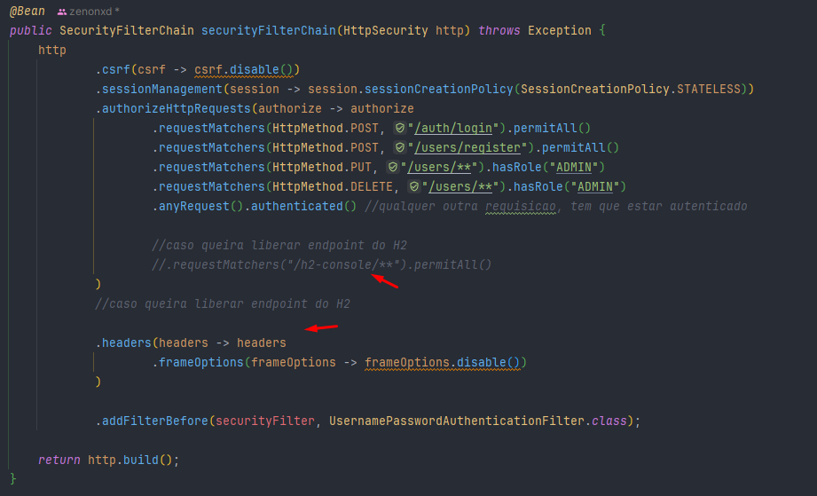
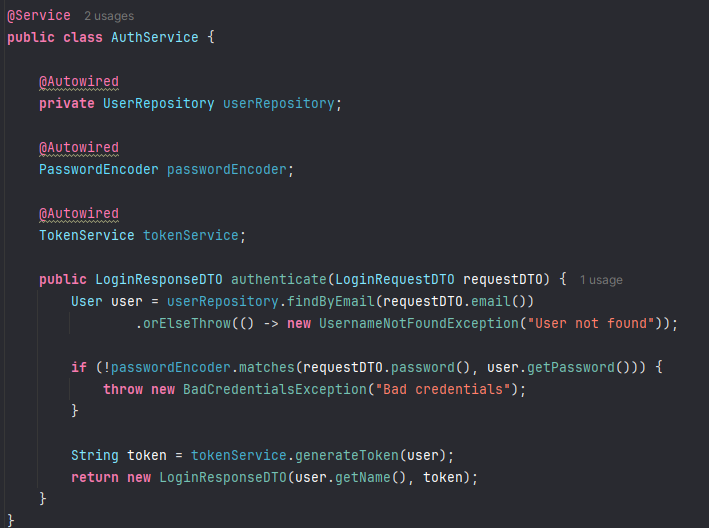
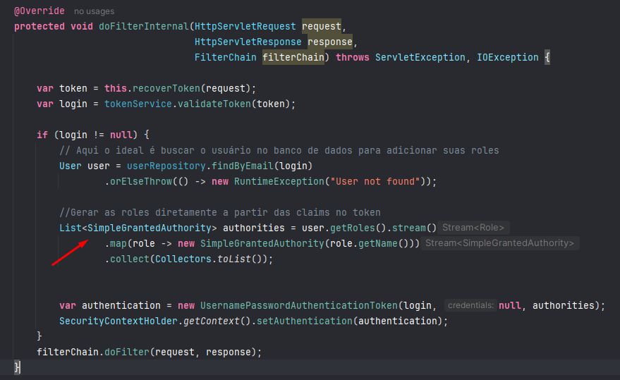
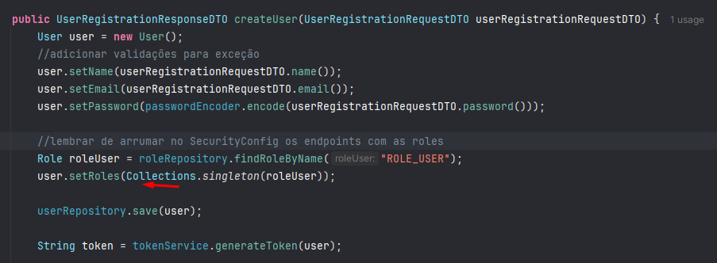
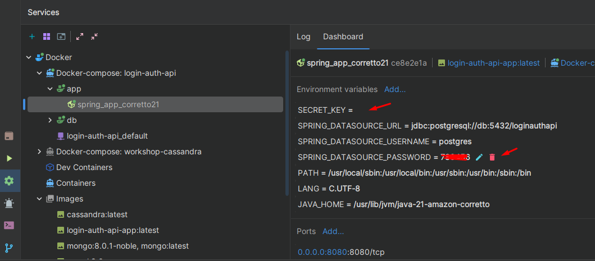
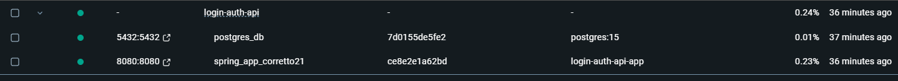
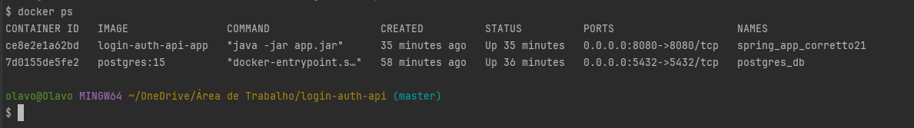

[Notion do Projeto - Fernanda Kipper](https://metal-flea-041.notion.site/Backend-Projeto-Fullstack-App-de-Login-58cb6fbf5dce4dfcb541fd7b7e7e157b)

# Etapas

## Criar Projeto

- [ ] Spring Web
- [ ] Spring Data Jpa
- [ ] Spring Boot Dev Tools
- [ ] Spring Security
- [ ] Lombok
- [ ] JWT
- [ ] H2

## Dependência H2 e JWT

```xml
<dependency>
    <groupId>com.h2database</groupId>
    <artifactId>h2</artifactId>
    <scope>runtime</scope>
</dependency>

<dependency>
    <groupId>com.auth0</groupId>
    <artifactId>java-jwt</artifactId>
    <version>4.4.0</version>
</dependency>
```

## Config H2

```properties
spring.datasource.url=jdbc:h2:mem:testdb
spring.datasource.driver-class-name=org.h2.Driver
spring.datasource.username=sa
spring.datasource.password=
```

## Estrutura pacote

```text
Estrutura pacote
com.moreira.picpaychallenge
├── application        # Regras de negócio específicas de casos de uso
│   ├── dto            # Objetos de transferência de dados
│   ├── services       # Implementações dos casos de uso
│   └── mappers        # Conversores entre entidades e DTOs
├── domain             # Camada de domínio (regra de negócio essencial)
│   ├── entities       # Entidades (modelos de negócio)
│   ├── enums          # Enumerações utilizadas pelo domínio
│   ├── exceptions     # Exceções de domínio
│   └── repositories   # Interfaces para acesso a dados
├── infrastructure     # Camada de infraestrutura (detalhes técnicos)
│   ├── database       # Implementações de repositórios (ex: JPA, MongoDB)
│   ├── configuration  # Configurações (Beans, Security, etc.)
│   └── clients        # Integrações com APIs externas
└── presentation       # Camada de apresentação (entrada/saída)
    ├── controllers    # Endpoints REST
    ├── handlers       # Tratamento de erros e exceções
    └── responses      # Objetos de resposta específicos
```

- [ ] [ Criar entidade que representa o usuário](#user)
- [ ]  Criar `UserRepository`
- [ ] [Criar `TokenService` para geração e validação dos tokens](#tokenservice)
- [ ] [Criar SecurityFilter que irá ser o filtro de segurança](#securityfilter)
- [ ] [Criar `CustomUserDetailsService` pro Spring consultar os usuários](#customuserdetailsservice)
- [ ] Criar `SecurityConfig` para configurar o Spring Security
- [ ] Criar `AuthController`
- [ ] Criar `DTOs` para request e response
- [ ] Criar controller autenticado
- [ ] Configurar CORS
- [ ] Integração com o Frontend

## User

# TokenService

Ficará no pacote infra.config.

O primeiro método dele será o método responsável por gerar/criar o Token quando o usuário fizer login/registro, se
chamará ``generateToken(User user)``.

Iremos criar um try-catch (JWTCreationException).

Primeira coisa é definir o algoritmo de criptografia que irá gerar o Token: ``Algorithm algorithm = Algorithm.HMAC256()``

Como parâmetro, iremos passar uma secretKey. 

Em resumo, esse algorithm pega uma informação e faz um hash com ela. Ele faz isso utilizando essa chave privada e só 
quem tem essa chave consegue descriptografar depois (obtendo a informação que está hasheada).

Essa chave privada do nosso servidor será responsável por isso: criptografar e descriptografar informações.

Criaremos uma ``private String secret``. (O valor dela virá do .properties) e podemos definir através da variável de
ambiente.

Agora sim, podemos gerar o nosso token, será do tipo String, dentro do try:

```java
JWT.create()
        //quem gerou o token
        .withIssuer("login-auth-api")
        //quem está ganhando o token
        .withSubject(user.getEmail())
        //tempo de expiracao
        .withExpiresAt()
        //gerando o token
        .sign(algorithm);
return token
```

Depois no catch, iremos capturar a JWTCreationException, lançando uma exceção (Runtime ou customizada).

Criaremos também um método auxiliar para settar o tempo de expiração do token.

Será um método privado, que irá retornar um instant! Seu nome pode ser ``generateExpirationDate``, vai retornar um
``LocalDateTime.now().plusHours(2).toInstant(ZoneOffset.of("-03:00"))``.

Inserir o método no ``.withExpiresAt()``.

```java
    private Instant generateExpirationDate() {
        return LocalDateTime.now().plusHours(2).toInstant(ZoneOffset.of("-03:00"));
    }
```

## Validando Token

Será um método que retornará uma String, se chamará ``validateToken``. Receberá como parâmetro uma String (token).

Faremos um try-catch, pois caso dê algum erro o JWT irá retornar uma exceção (JWTVerificationException).

Caso caia no catch, retornaremos somente null. 

Será null, pois caso a gente consiga validar no try, irá ser retornado o email do usuário (que está nesse token). 

Caso caia null, eventualmente iremos fazer uma função no filter chain (uma cadeia de segurança que será criada), onde 
irá dizer que o usuário não foi autenticado.

O try ficará a mesma coisa do método de criação. Iremos instanciar um Algorithm com a secretKey e retornaremos
```java
JWT.require(algorithm)
    .withIssuer(login-auth-api)
    .build()
    .verify(token)
    //subject pega o valor que foi salvo no token no momento da geração (metodo inicial)
    .getSubject()
```

### Classe final

```java
@Service
public class TokenService {

   @Value("${secretKey}")
   private String secret;

   public String generateToken(User user) {

      try {
         Algorithm algorithm = Algorithm.HMAC256(secret);
         String token = JWT.create()
                 .withIssuer("login-auth-api")
                 .withSubject(user.getEmail())
                 .withExpiresAt(generateExpirationDate())
                 .sign(algorithm);
         return token;

      } catch (JWTCreationException e) {
         throw new RuntimeException("Error while authenticating user");
      }
   }

   public String validateToken(String token) {

      try {
         Algorithm algorithm = Algorithm.HMAC256(secret);
         return JWT.require(algorithm)
                 .withIssuer("login-auth-api")
                 .build()
                 .verify(token)
                 .getSubject();
      } catch (JWTVerificationException e) {
         return null;
      }
   }

   private Instant generateExpirationDate() {
      return LocalDateTime.now().plusHours(2).toInstant(ZoneOffset.of("-03:00"));
   }
}
```

# SecurityFilter (Detalhar o método depois)

Também ficará em infra.security.

Será um filtro de segurança. Irá pegar o retorno do Token e autenticar ou não o usuário.

Ele será algo padronizado, portanto, é só inserir o código abaixo:

```java
@Component
public class SecurityFilter extends OncePerRequestFilter {

   @Autowired
   private TokenService tokenService;  // Servico para gerar e validar o JWT

   @Autowired
   private UserRepository userRepository;

   @Override
   protected void doFilterInternal(HttpServletRequest request,
                                   HttpServletResponse response,
                                   FilterChain filterChain) throws ServletException, IOException {

      var token = this.recoverToken(request);
      var login = tokenService.validateToken(token);

      if (login != null) {
         // Aqui o ideal é buscar o usuário no banco de dados para adicionar suas roles
         User user = userRepository.findByEmail(login)
                 .orElseThrow(() -> new RuntimeException("User not found"));

         //Gerar as roles diretamente a partir das claims no token
         List<SimpleGrantedAuthority> authorities = user.getRoles().stream()
                 .map(role -> new SimpleGrantedAuthority(role.getName()))
                 .collect(Collectors.toList());


         var authentication = new UsernamePasswordAuthenticationToken(login, null, authorities);
         SecurityContextHolder.getContext().setAuthentication(authentication);
      }
      filterChain.doFilter(request, response);
   }

   private String recoverToken(HttpServletRequest request) {
      var bearerToken = request.getHeader("Authorization");
      if (bearerToken != null && bearerToken.startsWith("Bearer ")) {
         return bearerToken.replace("Bearer ", "");
      }

      return null;
   }
}
```

## Entendendo a extensão

### OncePerRequestFilter

Irá ser executado uma vez para cada request que chegar na API. O Spring Security nada mais é do que um filtro para o 
nosso Controller. Antes da informação chegar no controller e ser processada no Service, esse filtro do Spring Security
irá agir antes, autenticando ou não o usuário.

## Entendendo métodos

### Recover Token

Método auxiliar. Recebe um HttpServletRequest (que veio do usuário), pega a header (authorization) e testa para ver se
ela está nula.

Entenda, se você muda onde você passa o token (para o body, por exemplo), você precisa mudar essa função (recoverToken).

Se a header não estiver nula, nós iremos dar um replace no bearer por vazio!

Geralmente fica assim: "Authorization: Bearer {token aqui}".

O que nós fazemos no replace, é retirar esse Bearer, deixando somente o token: "Authorization: {token aqui}".

E nós retornamos esse valor!

### DoFilterInternal (Detalhar mais o método)

É o método do filtro em sí.

Iremos criar uma variável token, utilizando o método [Recover Token](#recover-token).

Criar outra variável para login, onde iremos utilizar o Service juntamente com o método de validação (validateToken).

Essa variável será em suma é o email (que é o que é retornado no nosso método).

❗❗Não confunda, o ``generateToken`` do TokenService gera um token. O ```validateToken`` recebe o token gerado e valida,
retornando o email autenticado.

Depois um if, verificando se esse login não está nulo. Caso não esteja, iremos:

1. Procurar o User pelo email;
2. Criar uma Lista de SimpleGrantedAuthority, pegando as roles do User e mapeando elas para SimpleGrantedAuthority.
3. Criar um objeto de autenticação, instanciando um new ``UsernamePasswordAuthenticationToken(login, null, authorities)``.
4. Após criar esse objeto de autenticação, settaremos o SecurityContextHolder.getContext().setAuthentication(variável de
   autenticação aqui).

Esse SecurityContextHolder é o contexto de segurança do Spring Security! Cada componente do Security é responsável por
uma etapa, e elas vão alimentando o contexto do Security, para que ele saiba o que ele já validou ou não e salvar
as informações do Usuário que já estiver autenticada.

RESUMO:

1. Pegar o token do usuário pelo método recoverToken (que recebe uma Request HTTP);
2. Cria uma variável de login para validar o token utilizando o [tokenService](#tokenservice);
3. Se o login não for nulo, o usuário será adicionado no contexto do Spring;
4. Se o login for nulo (não estiver logado), nada será adicionado no contexto.

# CustomUserDetailsService

Classe que o Spring Security utiliza para consultar os Usuários.

Essa classe irá implementar a interface UserDetailsService (que vem do Spring Security).

Essa interface possui alguns métodos obrigatórios (loadUserByUsername).

Por isso, injetaremos o UserRepository, para podermos utilizá-lo dentro do método.

Dentro do método em sí, iremos instanciar um novo User, utilizando o repository para encontrar o mesmo pelo email, 
utilizando a propria exceção do Spring Security (UsernameNotFoundException).

Lembrando, o retorno é um UserDetails (um user na visão do Spring Security), não user entidade. Passaremos no retorno
o email, password e o array de roles.

```java
@Component
public class CustomUserDetailsService implements UserDetailsService {

    @Autowired
    private UserRepository userRepository;

    @Override
    public UserDetails loadUserByUsername(String username) throws UsernameNotFoundException {
       User user = userRepository.findByEmail(username)
                .orElseThrow(() -> new UsernameNotFoundException("User not found"));

        return new org.springframework.security.core.userdetails.User(user.getEmail(), user.getPassword(), new ArrayList<>());

    }
}
```

# SecurityConfig

Classe de configuração final para o Spring Security. 

Ela irá juntar tudo que montamos até agora, adicionando o filtro (proxy), em cada uma das requisições.

A classe ficará em infra.security.

```java
@Configuration
@EnableWebSecurity
public class SecurityConfig {

   @Autowired
   private CustomUserDetailsService customUserDetailsService;

   @Autowired
   private SecurityFilter securityFilter;

   @Bean
   public SecurityFilterChain securityFilterChain(HttpSecurity http) throws Exception {
      http
              .csrf(csrf -> csrf.disable())
              .sessionManagement(session -> session.sessionCreationPolicy(SessionCreationPolicy.STATELESS))
              .authorizeHttpRequests(authorize -> authorize
                              .requestMatchers(HttpMethod.POST, "/auth/login").permitAll()
                              .requestMatchers(HttpMethod.POST, "/users/register").permitAll()
                              .requestMatchers(HttpMethod.PUT, "/users/**").hasRole("ADMIN")
                              .requestMatchers(HttpMethod.DELETE, "/users/**").hasRole("ADMIN")
                              .anyRequest().authenticated() //qualquer outra requisicao, tem que estar autenticado

                      //caso queira liberar endpoint do H2
                      //.requestMatchers("/h2-console/**").permitAll()
              )
              //caso queira liberar endpoint do H2

              .headers(headers -> headers
                      .frameOptions(frameOptions -> frameOptions.disable())
              )

              .addFilterBefore(securityFilter, UsernamePasswordAuthenticationFilter.class);

      return http.build();
   }

   @Bean
   public PasswordEncoder passwordEncoder() {
      return new BCryptPasswordEncoder();
   }

   @Bean
   public AuthenticationManager authenticationManager(AuthenticationConfiguration authenticationConfiguration) throws Exception {
      return authenticationConfiguration.getAuthenticationManager();
   }
}
```

## Entendendo a classe

### Anotação @EnableWebSecurity

Diz para o Spring que essa classe é responsável por cuidar da configuração/segurança da parte web.

### Método securityFilterChain

#### csrf(csrf -> csrf.disable())

Esta linha desativa a proteção CSRF (Cross-Site Request Forgery), o que é comum em APIs REST. Em aplicativos que não 
utilizam sessões e que dependem de tokens (como JWT), desabilitar o CSRF é uma prática comum.

#### sessionManagement

É stateless (visto que é uma aplicação REST). Ou seja, toda API RESTful é stateless, logo, não guardam estado de login
dentro delas. Portanto, toda vez que o usuário logar na aplicação, ele precisa bater o token de autenticação, não 
teremos um banco de dados temporário para saber quem já se autenticou.

#### authorizeHttpRequests

Colocamos aquele parte de ``.authorizeHttpRequests()``, para dizer que os endpoints ``/auth/login`` e ``/users/register``,
não precisam de autenticação, porque por padrão quando adicionamos o Spring Security na nossa aplicação ele já bloqueia 
todos os endpoints. Então especificamente, estamos liberando esses dois.

#### requestMatchers hasRole 'ADMIN'

Restrição por role ADMIN: A parte crítica é essa. Somente usuários com a role ADMIN poderão fazer PUT ou DELETE nos 
endpoints /users/**. Isso garante que apenas administradores possam realizar essas operações.

#### anyRequest().authenticated()

Aqui dizemos que, no tocante aos outros endpoints, os usuários precisam estar autenticados.

#### Liberando o banco H2

Caso queira liberar o banco H2, insira isso abaixo de ``anyRequest()``:

```java
.requestMatchers("/h2-console/**").permitAll()
```

E depois:

```java
.headers(headers -> headers
    .frameOptions(frameOptions -> frameOptions.disable())
)
```



#### addFilterBefore

Por fim, passamos um método ``.addBefore()``, passando o SecurityFilter. Ou seja, antes de qualquer coisa do método
(essa parte de autorização acima), iremos adicionar esse filtro, ele rodará antes.

[Relembre o SecurityFilter](#securityfilter)

Através do addBefore, poderemos verificar o header de "authorization", vendo se o usuário passou. Se estiver, iremos
continuar para o Controller, caso contrário será barrado, retornando um 403.

### PasswordEncoder & AuthenticationManager

Irá servir para criar o Bean das duas classes.

PasswordEncoder iremos utilizar no Controller, para encondar a senha (para não salvar a password como String bruta) 
no banco de dados.

AuthenticationManager usaremos somente para o Spring Security conseguir funcionar.

# AuthService

Receberá o UserRepository + PasswordEncoder + TokenService.

Criaremos um método para autenticar, ele irá retornar um ``LoginResponseDTO`` e receberá ``LoginRequestDTO``.

Instanciaremos um User pelo seu email.

Faremos a lógica de negócio, testando se a senha passada como parâmetro é a senha do usuário existente no banco
de dados.

Se sim, iremos criar um Token de autenticação.

Se não, lançaremos uma exceção customizada (retornando BAD_REQUEST).



## DTOS

Como sempre, um para resposta (que irá no Postman) e outro que iremos receber da camada de controller.

### LoginResponseDTO

```java
public record LoginResponseDTO(String name, String token) {}
```

### LoginRequestDTO

```java
public record LoginRequestDTO(String email, String password) {}
```

# AuthController

Será responsável por receber as requisições de login.

Quais serão as requisições de login? E-mail e senha. Portanto, criaremos os nossos requests e responses com as 
informações necessárias.

Teremos um LoginRequestDTO e LoginResponseDTO.

## Método login

```java
@RestController
@RequestMapping(value = "/auth")
public class AuthController {

    @Autowired
    private AuthService authService;


    @PostMapping(value = "/login")
    public ResponseEntity<LoginResponseDTO> login(@RequestBody LoginRequestDTO loginRequestDTO) {
        LoginResponseDTO response = authService.authenticate(loginRequestDTO);

        return ResponseEntity.ok(response);
    }
}
```

# UserService

Receberá o UserRepository, RoleRepository, PasswordEncoder e TokenService.

Aqui realizaremos todo o CRUD + validação de dados para lançamento de exceções customizadas.

## CreateUser

```java
    public UserRegistrationResponseDTO createUser(UserRegistrationRequestDTO userRegistrationRequestDTO) {
        //antes de tudo, chegar se email já existe no banco de dados, se sim, continua

        if (userRepository.existsByEmail(userRegistrationRequestDTO.email())) {
            throw new EmailInUseException("Email already in use.");
        }

        if (userRegistrationRequestDTO.password().length() < 6) {
            throw new PasswordException("Password must be at least 6 characters.");
        }

        User user = new User();
        //adicionar validações para exceção
        user.setName(userRegistrationRequestDTO.name());
        user.setEmail(userRegistrationRequestDTO.email());
        user.setPassword(passwordEncoder.encode(userRegistrationRequestDTO.password()));

        user.setRole("ROLE_COMMON");

        //lembrar de arrumar no SecurityConfig os endpoints com as roles

        userRepository.save(user);

        String token = tokenService.generateToken(user);

        return new UserRegistrationResponseDTO(
                user.getId(),
                user.getName(),
                user.getEmail(),
                user.getPassword(),
                token
        );
    }
```

## FindAllPaged

```java
    public Page<UserPageableResponseDTO> findAllPageable(Pageable pageable) {
        Page<User> users = userRepository.findAll(pageable);

        List<UserPageableResponseDTO> usersDtos = users.getContent().stream()
                .map(user -> new UserPageableResponseDTO(user.getId(), user.getName(), user.getEmail()))
                .collect(Collectors.toList());

        return new PageImpl<>(usersDtos, pageable, users.getTotalElements());
    }
```

## UpdateUser

```java
    public UserChangesResponseDTO update(String id, UserChangesRequestDto userChangesRequestDto) {
   //implementar metodo para buscar por ID lançando exceção automaticamente
   User user = userRepository.findById(id)
           .orElseThrow(() -> new UsernameNotFoundException("User not found"));

   user.setName(userChangesRequestDto.name());
   user.setEmail(userChangesRequestDto.email());
   userRepository.save(user);

   return new UserChangesResponseDTO(
           user.getId(),
           user.getName(),
           user.getEmail()
   );
}
```

## FindUserById

```java
    public UserInformationsResponseDTO findById(String id) {
        User user = userRepository.findById(id)
                .orElseThrow(() -> new UsernameNotFoundException("User not found"));

        return new UserInformationsResponseDTO(
                user.getId(),
                user.getName(),
                user.getEmail(),
                user.getRoles());
    }
```

## DeleteUser

```java
    public void deleteById(String id) {
        if (!userRepository.existsById(id)) {
            throw new UsernameNotFoundException("User not found.");
        }
        userRepository.deleteById(id);
    }
```

## InsertRoleOnUser

```java
    @Secured(("ROLE_ADMIN"))
    public UserWithNewRoleResponseDTO insertRoleOnUser(String id, UserWithNewRoleRequestDTO userWithNewRoleRequestDTO) throws AccessDeniedException {

        if (!userRepository.existsById(id)) {
            throw new UsernameNotFoundException("User not found.");
        }

        Authentication authentication = SecurityContextHolder.getContext().getAuthentication();

        boolean isAdmin = authentication.getAuthorities().stream()
                .anyMatch(authority -> authority.getAuthority().equals("ROLE_ADMIN"));

        if (!isAdmin) {
            throw new AccessDeniedException("You dont have the permission to do this action.");
        }

        User user = userRepository.getReferenceById(id);
        Set<Role> roles = new HashSet<>(roleRepository.findByNameIn(userWithNewRoleRequestDTO.roles()));

        user.getRoles().addAll(roles);

        userRepository.save(user);

        return new UserWithNewRoleResponseDTO(
                user.getId(),
                user.getName(),
                user.getEmail(),
                user.getRoles().stream().map(Role::getName).collect(Collectors.toSet())
        );
    }
```

# UserController

## CreateUser

```java
    @PostMapping("/register")
    public ResponseEntity<UserRegistrationResponseDTO> createUser(@RequestBody UserRegistrationRequestDTO userRegistrationRequestDTO) {

        UserRegistrationResponseDTO responseDTO = userService.createUser(userRegistrationRequestDTO);

        URI uri = ServletUriComponentsBuilder
                .fromCurrentRequest()
                .path("/{id}")
                .buildAndExpand(responseDTO.id())
                .toUri();

        return ResponseEntity.created(uri).body(responseDTO);
    }
```

## FindAllPaged

```java
    @PreAuthorize("hasRole('COMMON')")
    @GetMapping
    public ResponseEntity<Page<UserPageableResponseDTO>> findAllPageable(Pageable pageable) {
        Page<UserPageableResponseDTO> users = userService.findAllPageable(pageable);

        return ResponseEntity.ok(users);
    }
```

## UpdateUser

```java
    @PreAuthorize("hasRole('ADMIN')")
@PutMapping(value = "/{id}")
public ResponseEntity<UserChangesResponseDTO> update(@PathVariable String id, @RequestBody UserChangesRequestDto userChangesRequestDto) {
   UserChangesResponseDTO userChanged = userService.update(id, userChangesRequestDto);

   return ResponseEntity.ok(userChanged);
}
```

## FindUserById

```java
    @PreAuthorize("hasRole('COMMON')")
    @GetMapping(value = "/{id}")
    public ResponseEntity<UserInformationsResponseDTO> findById(@PathVariable String id) {
        UserInformationsResponseDTO response = userService.findById(id);

        return ResponseEntity.ok(response);
    }
```

## DeleteUser

```java
    @PreAuthorize("hasRole('ADMIN')")
    @DeleteMapping(value = "{id}")
    public ResponseEntity<Void> deleteById(@PathVariable String id) {
        userService.deleteById(id);

        return ResponseEntity.noContent().build();
    }
```

## InsertRoleOnUser

```java
 @PreAuthorize("hasRole('ADMIN')")
    @PutMapping(value = "/insert/{id}")
    public ResponseEntity<UserWithNewRoleResponseDTO> insertRoleOnUser(@PathVariable String id,
                                                                      @RequestBody UserWithNewRoleRequestDTO userWithNewRoleRequestDTO) throws AccessDeniedException {

        UserWithNewRoleResponseDTO userWithNewRole = userService.insertRoleOnUser(id, userWithNewRoleRequestDTO);

        return ResponseEntity.ok(userWithNewRole);
    }
```

# Adendos no projeto

1. O banco de dados será PostgreSQL
2. Utilizaremos flyway para fazer as migrations e criar as tabelas
3. Criamos uma entidade com Role que será adicionada ao User com ManyToMany.
4. A classe SecurityFilter agora, ela retorna uma Lista de SimpleGrantedAuthority que pegará as roles de user, e irá
mapeá-las:



6. Em UserService, instanciaremos uma Role, buscando-a por name (no seu RoleRepository) e settando a role do usuário
antes de salvar:




```xml
<dependency>
    <groupId>org.flywaydb</groupId>
    <artifactId>flyway-core</artifactId>
</dependency>
```

## Criando tabela Role

```sql
CREATE EXTENSION IF NOT EXISTS "pgcrypto";

CREATE TABLE tb_role (

    /*
    get_random_uuid é uma função
    de uma extensão do Postgres
    onde iremos instalar depois.
    Ela irá gerar uma random UUID
    */
    id VARCHAR DEFAULT gen_random_uuid() PRIMARY KEY,
    name VARCHAR(30) NOT NULL UNIQUE
);
````

### Insert

```sql
INSERT INTO tb_role (name) 
VALUES 
    ('ROLE_OPERATOR'),
    ('ROLE_COMMON'),
    ('ROLE_ADMIN');
```

## Criando tabela User

```sql
CREATE EXTENSION IF NOT EXISTS "pgcrypto";

CREATE TABLE tb_user (

    /*
    get_random_uuid é uma função
    de uma extensão do Postgres
    onde iremos instalar depois.
    Ela irá gerar uma random UUID
    */
    id VARCHAR DEFAULT gen_random_uuid() PRIMARY KEY,
    name VARCHAR(30) NOT NULL,
    email VARCHAR(30) NOT NULL,
    password VARCHAR(100) NOT NULL,
    role_id varchar,
    CONSTRAINT fk_role
                     FOREIGN KEY (role_id)
                     REFERENCES tb_role(id)
                     ON DELETE SET NULL
);
```

### Insert

Serão feitos pelo Postman.


# Endpoints postman

## CreateUser

```http request
POST http://{{host}}/users/register

{
  "name": "Olavo Moreira",
  "email": "olavo@gmail.com",
  "password": "password123"
}
```

## Login

```http request
POST http://{{host}}/auth/login

{
  "email": "olavo@gmail.com",
  "password": "password123"
}
```

## FindAllPaged

## FindById

Authorization: Bearer Token (ROLE_COMMON) at least.

```http request
GET http://{{host}}/users/{{id}}}}
```

## Delete

Authorization: Bearer Token (ADMIN)

```http request
DELETE http://{{host}}/users/{{id}}}}
```

## UpdateUser

Authorization: Bearer Token (ADMIN)

```http request
PUT http://{{host}}/users/{{id}}}}

{
  "name": "Olavo Moreira",
  "email": "olavo@example.com",
  "password": "password123"
}
```

## InsertUserRoles

Authorization: Bearer Token (ADMIN)

```http request

PUT http://{{host}}/users/insert-role/{{id}}}}

{
  "roles": ["ROLE_COMMON", "ROLE_ADMIN", "ROLE_OPERATOR"]
}
```

# Colocando o projeto em Docker

Ao rodar o DockerCompose, ele irá também rodar o dockerfile criando a imagem.

Caso dê algum problema para se conectar a database, aloque as variáveis diretamente no container:



A ideia é que fique rodando a db (5432) e o app (8080)



## Comandos:

>docker ps ver o que tá rodando



> docker exec -it postgres_db psql -U postgres -d loginauthapi

Listar tabela
>\dt

Para sair do PostgreSQL e voltar para o terminal do seu sistema, basta digitar o comando:

>\q


## Dockerfile

```dockerfile
FROM amazoncorretto:21

LABEL authors="olavo"

WORKDIR /app

# Copiar o JAR gerado pelo build para dentro do contêiner
# O arquivo JAR será copiado para o contêiner. O caminho depende de onde você gerar o JAR.
COPY target/login-auth-api-0.0.1-SNAPSHOT.jar app.jar

# Expor a porta onde o Spring Boot será executado
EXPOSE 8080

CMD ["java", "-jar", "app.jar"]
```

## Dockercompose-yml

No properties, a URL é aquela padrão do JDBC para conectar no postgres. Aqui, usamos ``db:``.

```dockerfile
version: '3.8'
services:
  app:
    build:
      context: ../login-auth-api
      dockerfile: Dockerfile
    container_name: spring_app_corretto21
    environment:
      SPRING_DATASOURCE_URL: jdbc:postgresql://db:5432/loginauthapi
      SPRING_DATASOURCE_USERNAME: postgres
      SPRING_DATASOURCE_PASSWORD: ${POSTGRES_PASSWORD}
      SECRET_KEY: ${SECRET_KEY}
    ports:
      - "8080:8080"
    depends_on:
      - db

  db:
    image: postgres:15
    container_name: postgres_db
    environment:
      POSTGRES_USER: postgres
      POSTGRES_PASSWORD: ${POSTGRES_PASSWORD}
      POSTGRES_DB: loginauthapi
    ports:
      - "5432:5432"
    volumes:
      - postgres_data:/var/lib/postgresql/data

volumes:
  postgres_data:
```
